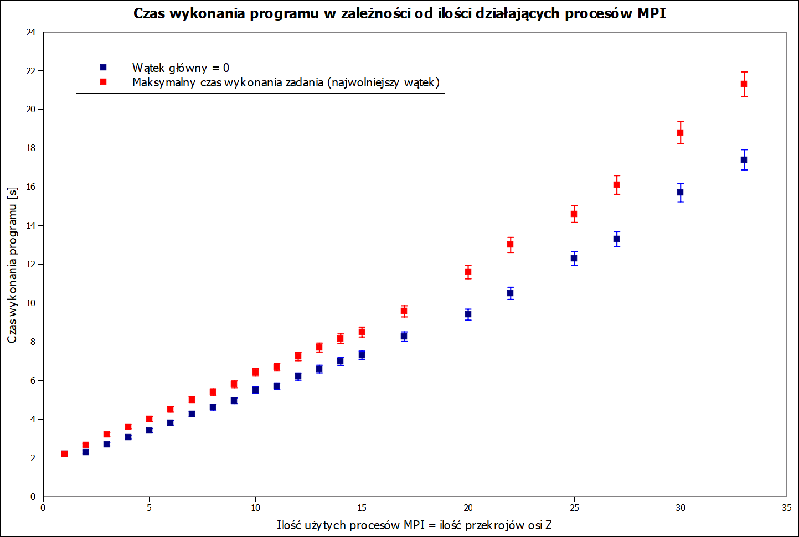
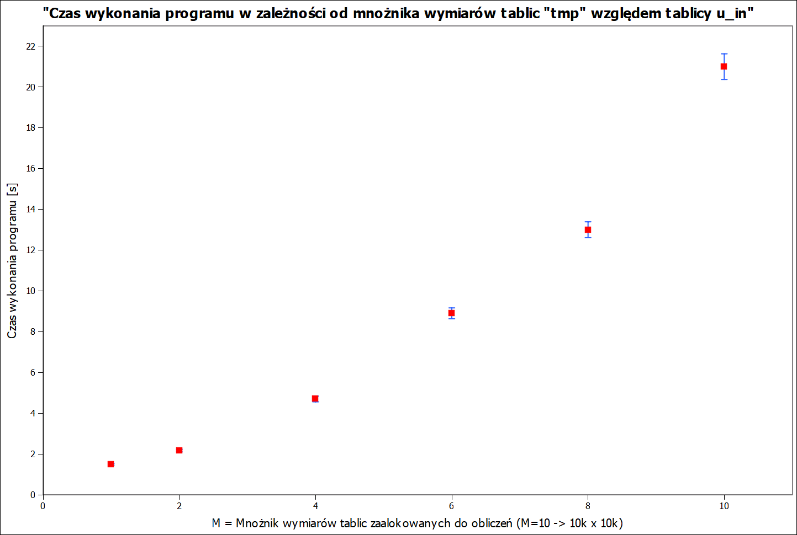

# Nowoczesne Technologie Obliczeniowe - 2019
## Projekt CUDA - propagacja światła za przeźroczem - model 3D

Projekt opierający się o komunikację MPI i bibliotekę CUDA, by wykorzystać pełny potencjał obliczeniowy klastra DWARF wydziału Fizyki PW.  

Program w skrócie wykonuje się w następujących krokach:
1.  Stworzenie dwuwymiarowej tablicy o wymiarach zadanych przez użytkownika (tablica ta jest przezroczem, przez które będzie propagować się światło).
2.  Wpisanie tablicy utworzonej w punkcie 1 do dwa razy większej tablicy (mniejsza tablica umieszczona w środku większej).
3.  Nowo utworzona tablica (od teraz nazywana tablicą wejściową) kopiowana jest na kartę graficzną (GPU).
4.  Na GPU liczona jest szybka transformata Fouriera (FFT) tablicy wejściowej.
5.  Wynik wysyłany jest do procesów MPI, który następnie kopiowany jest na GPU.
6.  Każdy proces oblicza dwuwymiarową tablicę odpowiedzi impulsowej (h(z) - zależna od odległości propagacji z) i wysyła ją na GPU.
7.  GPU obliczają FFT odpowiedzi impulsowej, a następnie mnożą transformatę tablicy wejściowej z transformatą odpowiedzi impulsowej.
8.  Wynik mnożenia zostaje poddany odwrotnej transformacie Fouriera. Po wykonaniu odwrotnej transformaty, jej wynik kopiowany jest z GPU na hosta.
9.  Otrzymana tablica danych zostaje poddana operacji ROLL. 
10. Ostateczny wynik zostaje zapisany do pliku.

Pełny kod dostępny jest w repozytorium pod linkiem: [prop.cu](https://gitlab.com/SimonPW/nto-2019/blob/master/Propagation%20-%20C++%20&%20CUDA/prop.cu)

Jako metodę symulacji propagacji światła wykorzystano metodę splotową. Bardzo dobrą literaturą ukazującą algorytm, jak i zalety i wady tej metody jest artykuł profesora Macieja Sypka [[1]](https://gitlab.com/SimonPW/nto-2019/blob/master/B_01_199504_OptComm.PDF). Ze względu na czasochłonne obliczenia związane ze splotem dwóch funkcji, w tym przypadku tablicy wejściowej (u1) oraz odpowiedzi impulsowej (*h*) - PSF (Point Spread Function), wykorzystano własności transformacji Fouriera. Szybszą i wydajniejszą metodą będzie zrobienie *FFT{u1}* oraz *FFT{h}* i wymnożenie obu tablic ze sobą, *U2* = *FFT{u1}* x *FFT{h}*. Wynikiem odwrotnej transormaty Fouriera  tablicy *U2* , będzie tablica zespolonych wartości, *u2* , które zawierają informację o amplitudzie i fazie w danym miejscu w przestrzeni.  

Program przedstawia rozkład amplitudy fali świetlnej za przezroczem w zadanych przez użytkownika odległościach (z) od tego przezrocza. Rozkłady w różnych odległościach liczone są równolegle przez procesy MPI.
Jedną z wad tego algorytmu są krawędzie tablic - wprowadzające zniekształcenia i wysokoczęstotliwościowy szum. Aby pominąć szkodliwe efekty *FFT* na krawędziach wprowadza się modyfikację algorytmu w postaci powiększenia tablic obliczeniowych do wymiarów *2Nx2N*. Tablica wejściowa, *NxN* , w tym przypadku przepisywana jest na środek większej tablicy. Tablicą wyjściową jest środkowa część *NxN*.

Stworzenie tablicy wejściowej, wpisanie jej do większej tablicy oraz wykonanie transformaty tej tablicy robione jest wyłącznie przez proces "0". Reszta procesów oblicza odpowiedź impulsową, zależną od odległości z od przezrocza, różnej dla każdego procesu.
Następnie każdy proces mnoży tranformatę tablicy wejściowej z transformatą odpowiedzi impulsowej. otrzymany wynik następnie poddawany jest odwrotnej transformacie Fouriera i przesyłany z GPU na hosta.

* [x] Przegląd Literatury

Propagacja światła koherentnego przez dowolne przeźrocze - dyfrakcja - jest ciągle ciekawym tematem dla naukowców - pomaga zrozumieć naturę światła i jest szeroko wykorzystywana podczas symulacji układów optycznych. 
Istnieje kilka metod symulacji propagacji światła m.in. liczenie całki tablicy wejściowej oraz metoda splotowa.

## Wybór rodzaju obliczeń: 
* [ ] Obliczenia na tablicach o dużych wartościach *N* (duża precyzja lub duża powierzchnia przeźrocza)
* [x] Obliczenia wzdłuż osi *Z* (duża odległość lub duża dokładność)
____________________________________________________________________________________________________________

* [x] Implementacja algorytmu w C++

* [x] Optymalizacja kodu pod kątem CUDA

* [x] Wykorzystanie MPI i CUDA

* [ ] Docelowa architektura wykorzystująca protokół MPI i wiele GPU na jednym węźle

____________________________________________________________________________________________________________

## Wykonane testy skalowania: 

Program został odpowiednio zoptymalizowany pod kątem pamięci, by nie było niepotrzebnych tablic zajmujących miejsce. W trakcie działania programu zauważono następujące maksymalne wartości użycia pamięci RAM na GPU:

| u_in | Mnożnik M | Rozmiar Tablic tymczasowych | Max. użycie RAM-u na GPU [MiB] |
| ------ | ------ | ------ | ------ |
| 1024x1024 | 1 | 1024x1024 | 130 |
| 1024x1024 | 2 | 2048x2048 | 356 |
| 1024x1024 | 4 | 4096x4096 | 1380 |
| 1024x1024 | 6 | 6144x6144 | 2980 |
| 1024x1024 | 8 | 8192x8192 | 5220 | 
| 1024x1024 | 10 | 10240x10240 | 8100 | 

Karty Tesla K80 posiadają 11439 MiB możliwej do użycia pamięci RAM. Jak widać tymczasowe użycie pamięci GPU przy mnożniku M=10, sięga ponad 8 GiB. Przy wyższych mnożnikach, np. M=12, program wykonuje część zadań a podczas próby alokowania zbyt dużej ilości danych na GPU - funkcje zwracają problem z tworzeniem/alokowaniem pamięci.

Do testowania propagacji posłużyła nam tablica przechowująca informacje o przezroczu o wymiarach 1024x1024 (wcześniej przetworzonej z BMP do txt).
Przezrocze (jako jasne punkty w tablicy) wyglądało następująco:

## Przykładowe tablice (1024x1024) po propagacji na zadane odległości: 

| Z = 500 mm | Z = 600 mm | Z = 700 mm | Z = 800 mm |
| ------ | ------ | ------ | ------ |
|||||
| | | | |
| Z = 900 mm | Z = 1000 mm | Z = 1500 mm | Z = 1700 mm |
|||||

